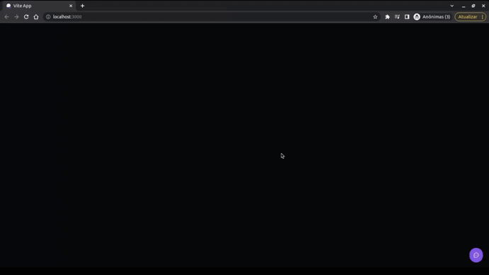

<h1 align="center">Feedget Web
	<br/>
	
	<br/>
</h1>

[](https://github.com/LeoMSSilva)
[](https://github.com/LeoMSSilva)
[](#)
[](https://github.com/LeoMSSilva/Feedget/stargazers)
[](https://github.com/LeoMSSilva/Feedget/network/members)
[](https://github.com/LeoMSSilva/Feedget/graphs/contributors)

---

# :pushpin: Table of Contents

- :house: [About](#house-about)
- :dart: [Installation](#dart-installation)
  - :gear: [Install dependencies](#hammer_and_wrench-install-dependencies)
  - :rocket: [Getting started](#rocket-getting-started)
- :computer: [Techs](#computer-techs)
- :bust_in_silhouette: [Author](#bust_in_silhouette-author)
- :handshake: [Contributing](#handshake-contributing)
- :scroll: [License](#scroll-license)

---

# :house: About

**Vite** to manage the entire application.

**Vitejs plugin react swc** to speed up the build and auto reload in dev of the application.

**Typescript** as a programming language used through the **reactJs** framework and transpiled to **javascript**.

**React dom** to route application navigation.

**Axios** to make requests to the application back-end.

**TailwindCss** together with **postcss** and **autoprefixer** to style the web application.

**Tailwindcss forms** for the forms part in tailwind.

**Tailwind scrollbar** to handle web page scrollbar.

**HeadlessUI** to implement accessibility in the application.

**Phosphor react** to use icons.

**Html2canvas** to perform page capture.

**BiomeJs** for formatting and linting the code.

This app is used to send feedback with images and comments.

---

# :dart: Installation

**First you need to install:**

- [Node.js](https://pt-br.nodejs.org/) (required)
- [Yarn](https://yarnpkg.com/) (required)

  **Then in order, clone the project.**

By HTTPS, running this command:

```bash
  git clone https://github.com/LeoMSSilva/Feedget.git
```

Or by ssh, running this command:

```bash
  git clone git@github.com:LeoMSSilva/Feedget.git
```

SSH is a secure protocol, but you need to register a key ssh in your github before.

## :hammer_and_wrench: Install dependencies

```bash
  yarn
```

or

```bash
  yarn install
```

## :rocket: Getting Started

To run the *front-end* use:

```bash
  cd web
```

After being in the folder, run the following command to start the project:

```bash
  yarn dev
```

---

# :computer: Techs

- Autoprefixer
- Axios
- BiomeJs
- HeadlessUI
- Html2canvas
- Javascript
- Phosphor React
- Postcss
- React Dom
- ReactJs
- Tailwind Scrollbar
- TailwindCss
- Tailwindcss forms
- Typescript
- Vite
- Vitejs Plugin React SWC

---

# :bust_in_silhouette: Author

**LeoMSSilva**

- Github: [@LeoMSSilva](https://github.com/LeoMSSilva)
- LinkedIn: [@LeoMSSilva](https://linkedin.com/in/LeoMSSilva)

---

# :handshake: Contributing

Contributions, issues and feature requests are welcome! Feel free to **file a new issue** on the [Feedget](https://github.com/LeoMSSilva/Feedget/issues) repository. If you already found a solution to your problem, **I would love to review your pull request**!

---

# :scroll: License

Copyright :copyright: 2022 [LeoMSSilva](https://github.com/LeoMSSilva).
<br/>
This project is [MIT](https://github.com/LeoMSSilva/Feedget/blob/main/LICENSE) licensed.

---
